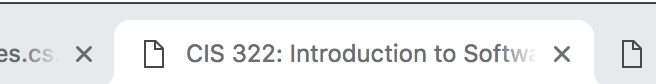
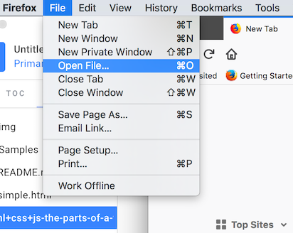
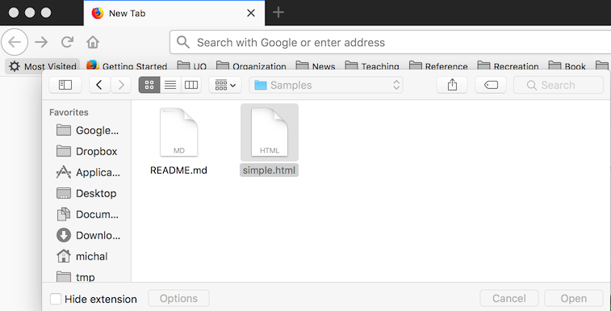
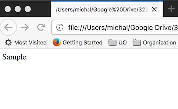
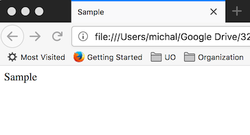

# HTML: Structure and Content

A _markup language_ is a notation in which textual notes \(markup\) indicate how the text should be formatted or otherwise processed.   The _hypertext markup language_, HTML, is a classic markup language with block-structured markup.  For example, the tags &lt;ul&gt; and &lt;/ul&gt; might mark off an _unnumbered list_, with each _list item_ preceded by &lt;li&gt; and followed by &lt;/li&gt;.

Tags may be nested \(e.g., a list may be enclosed in another list\), and a tag may optionally contain some additional parameters, so we might see, for example:

```
<ul class="monsters">
   <li>Swamp monsters</li>
   <li>The undead:
      <ul>
         <li>Ghosts</li>
         <li>Zombies</li>
      </ul>
   </li>
</ul>
```

We'll see some specific tags below, and some parameters.  Tags generally come in pairs, with a start tag &lt;_T_&gt; and an end tag &lt;/T&gt; \(where _T_ is some particular tag code like li or ul\), although we'll see a few tags that do not enclose a block and therefore have no matching end-tag.  These are best indicated with the form &lt;T /&gt; suggesting that they fill both the start-tag and end-tag role.  The line-break tag &lt;br /&gt; is an example of a tag that does not require a matching end tag.

Comments can be included in HTML using a form that looks almost like a tag:

```
<!-- This is a comment.  I can put 
   anything here, over any number of lines, much 
   like /* ... */ in C or Java. 
-->
```

A web page is represented by a single HTML document.  The overall structure of the HTML document is

```
<html>
   <head>
       <!--  head content discussed below -->  
   </head>
   <body>
      <!-- the visible content of the web page goes here -->  
   </body>
</html>
```

### Page content: &lt;body&gt; ... &lt;/body&gt;

The visible content of a web page \(headings, text, graphics, etc\) go in the "body" block, between &lt;body&gt; and &lt;/body&gt;.  Among the most common and important kinds of content blocks that we can indicate with tags are headers, paragraphs, and lists.

### Text content tags

Headings are indicated with "H" tags, from &lt;h1&gt;First-level heading&lt;/h1&gt; through &lt;h6&gt;Lowest level heading&lt;/h6&gt;.  In practice, h1 through h3 are fairly commonly used, and occasionally h4;  one seldom sees headings at levels 5 and 6.

Paragraphs are enclosed in &lt;p&gt; and &lt;/p&gt;.   Although technically it is permitted to omit the closing tag &lt;/p&gt;, it is a good habit to always balance a tag that begins a block with a closing tag.

Unordered \(that is, un-numbered\) lists, as we have seen, can be enclosed in &lt;ul&gt; and &lt;/ul&gt;, with each item enclosed in &lt;li&gt; and &lt;/li&gt;.  Ordered \(that is, numbered\) lists are similar but surrounded by &lt;ol&gt; and &lt;/ol&gt;.  Ordered and unordered lists can be arbitrarily nested, but tags should always properly match.

Text in HTML usually "flows", that is, line breaks are determined by the width of the page or the block in which the text is displayed.  Line breaks in the source text are irrelevant.  For example,

```
<p> This 
silly paragraph </p>
```

is displayed exactly the same as

```
<p>
This silly paragraph
</p>
```

Flow is usually what we want.  On rare occasions when we need to indicate a line break, we can do so with the tag &lt;br /&gt; where the line should break.

### Divisions and Spans

Often we wish to mark the structure of larger sections of content.  The "div" \(division\) tag is the all-purpose way to do that, usually with a "class" parameter indicating the kind of division.  For example, a class home page might include this:

```
<div class="pageheader">
   <div class="title">
   <h1>CIS 211, Winter 2019<br />
       Introduction to Computer Science 2
   </h1>
   </div> <!-- title -->
</div> <!-- pageheader -->
```

The "class" parameters will come in handy when we add style sheets to control formatting, below.

Similarly, we sometimes need to enclose just a small section of a single paragraph.  We can do so with a _span_, like this:

```
<p>Failing to lock the door will result <span class="stern">at the very least</span>
   in being eaten by zombies.</p>
```

Like the _class_ parameter of the &lt;div&gt; tag, a _class_ parameter in a &lt;span&gt; will be handy when we add style sheets.

### Links and Images

There are two main ways a web page may refer to content in another document:  By embedding that content in the page, or linking to it.  The familiar hypertext link uses the &lt;a&gt; tag with an href parameter to indicate the URL to link to, like this:

```
<p>You should definitely check out my 
<a href="http://my.spammy.site.com/spammy-spam">safety robots</a> 
to protect you and your precious family from zombies.</p>
```

A graphic can be embedded directly in the page with the &lt;img&gt; tag.  The most common formats are Portable Network Graphics \(.png\) for bitmap graphics and JPEG \(.jpg\) for continuous-tone images like photographs, although one still encounters bitmap graphics in the Graphics Interchange Format \(.gif\).  For example:

```
   
```

## The &lt;head&gt; block

All of this visible content in headings, paragraphs, lists, images, etc., goes between &lt;body&gt; and &lt;/body&gt;.  The head part of the document provides some additional information for the browser and for other clients that might access it.  Some of this is boilerplate, like a line that tells the browser what kind of text encoding it should expect:

```
<meta http-equiv="content-type" content="text/html; charset=iso-8859-1"/>
```

In most cases we'll just copy these lines from some generic template.  Some of the header content is aimed not at the browser, but at other programs.  For example, we can give the web "crawlers" \(also known as "spiders"\) of search engines hints about how to categorize the document:

```
<meta name="description" content="CIS 211, Intro to CS 2"/>
<meta name="keywords" content="Computer science"/>
```

Even if we don't care about being found by search engines, one element we usually do want is the &lt;title&gt;.  This is the text is associated with a bookmark, and also appears in the "tab" marker in many browsers.  For example:

```
<title>CIS 322: Introduction to Software Engineering | University of Oregon</title>
```

so that in the browser we will see:



### Exercise: A Minimal Web Page

The basic HTML introduced above is enough to build a simple, static web page, which we can easily test in a browser.  A web server is not necessary for this exercise, which should take only about 5 minutes.

Create an empty file called simple.html and open it any text editor \(vim, emacs, Notepad++, BBEdit, etc\);  if your editor has features for rich text or formatted text, be sure that you are working in plain text mode.  Start by copying this content into the file:

```
<!DOCTYPE HTML PUBLIC "-//IETF//DTD HTML//EN">
<html> 
<head> 
</head>
<title>
<body>
<p>Sample</p>
</body>
</html>
```

Save the file.  Next we will open it in a browser.  This was tested with Firefox, but other browsers \(Chrome, Safari, Edge, etc\) should work as well.  You may be able to drag and drop the file onto the browser, or you can use the 'open file' command from the browser menu, like this in Firefox:



and then



You should see something like this:



Notice that the tab label is a path to the file \(which will vary depending on where you saved the file\).  Let's fix that.  Leaving the browser window open, use your text editor to add the following in the head section \(between &lt;head&gt; and &lt;/head&gt;\):

```
<title>Sample</title>
```

Save the file, then use the 'refresh' button in your browser.  Now you should see:



Next, use heading and list tags in the editor to recreate the following in the browser display:


