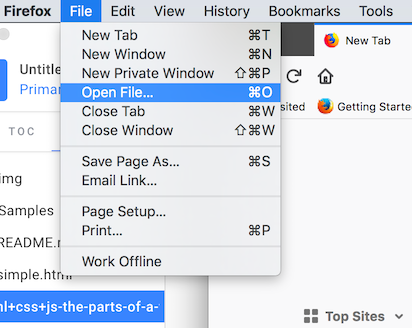
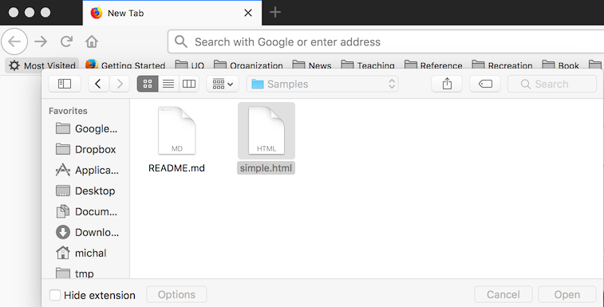
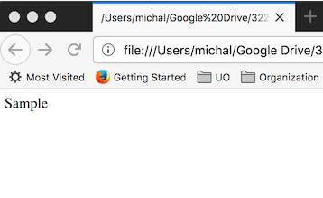
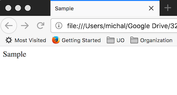
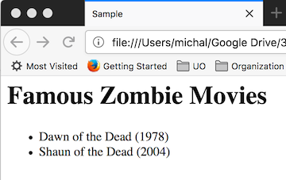
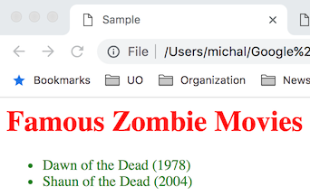
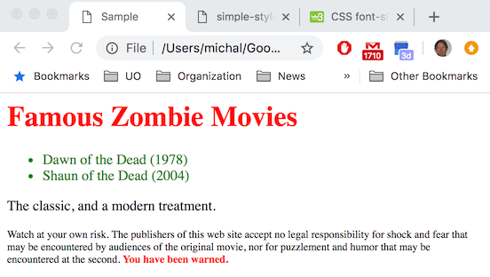
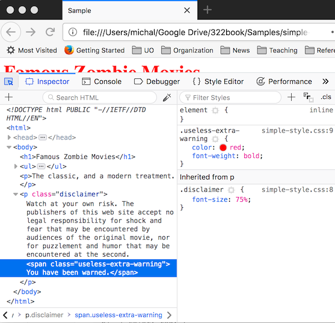

\(This is draft text in progress.  Portions are just outline and notes.\)

# HTML + CSS + JS: The components of a web page

A web page as experienced by the user has three major components:  HTML that contains the structure and main content of the page, CSS that controls its presentation \(layout, typefaces, etc\), and JavaScript that provides interactivity.  In this chapter we describe how these three parts fit together.  Whole volumes have been written about each of the three components, so you won't find an encyclopedic reference here, but you will find enough basic information to get started and build web pages that incorporate all three elements.  Most importantly, you will have enough understanding of the principles underlying the design to help you find and integrate more details when you want to go beyond the basics.

## Before the beginning: How we got here

Today we take for granted that the world-wide web is a distributed, federated system in which web servers transmit the content of web sites to browsers, which display it to users.  It wasn't always so.  Early hypertext systems were mostly not distributed systems, and did not make a clear distinction between the server and the client \(browser\).  These hypertext systems maintained complex internal records of each user's browsing path.  They were complex.  One of the early systems, HyperCard for the Apple Macintosh, was a fascinating glimpse of the potential of hypertext as a platform.  For example, the first version of the successful  adventure game Myst was implemented as a set of HyperCard "stacks".  But HyperCard was inherently a single computer, single user system.  The few distributed hypertext systems were far more limited, and producing content for them was difficult.

A key principle of the World-Wide Web as originally designed by Tim Berners-Lee was to create a client/server architecture in which the servers are extremely simple.  A web server does not lay out the text of a web page or combine graphics with text.  It does not determine what typefaces to use, or any other presentation information.  All the web server does is receive a URL and respond by transmitting a file.  The web page is just a text file, and all the server does is transmit it to the client.  The client \(what we call a browser\) is where the page is assembled from its parts, and where all the presentation decisions are made.  If there is a graphic image to be included in the page, the client makes a separate request to the server for the graphic, which transmits the file \(typically a .gif or .jpg\) just as it transmitted the web page.

The World-Wide Web was quickly successful, and displaced its competitors so thoroughly that today we hardly think of it as just one of the possible ways a hypertext system could be designed.  It has evolved considerably since its inception, but the basic principles of its design that made it successful in the first place remain:

* The server is dumb.  It just receives individual requests and sends files in reply. _The web server does not interpret the contents of a web page._ 
* The web client \(usually a browser\) interprets the content of a web page, which is usually coded in the hypertext markup language, HTML.  A page may contain links to other material, some of which \(e.g., graphics\) may be included in the presentation of the page to a user.  It is the browser that interprets those links and, as needed, makes additional requests to a web server for the content. That material doesn't even have to come from the same web server.  It is the browser that composes those parts into the page as the user sees it.

One additional principle, weakly present in the original design, has become a pillar of the architecture of the web:

* The structure and content of a web page, described in HTML, is separate from its presentation, described in CSS, and interactivity, represented in JavaScript. 

## HTML: Structure and Content

A _markup language_ is a notation in which textual notes \(markup\) indicate how the text should be formatted or otherwise processed.   The _hypertext markup language_, HTML, is a classic markup language with block-structured markup.  For example, the tags &lt;ul&gt; and &lt;/ul&gt; might mark off an _unnumbered list_, with each _list item_ preceded by &lt;li&gt; and followed by &lt;/li&gt;.

Tags may be nested \(e.g., a list may be enclosed in another list\), and a tag may optionally contain some additional parameters, so we might see, for example:

```
<ul class="monsters">
   <li>Swamp monsters</li>
   <li>The undead:
      <ul>
         <li>Ghosts</li>
         <li>Zombies</li>
      </ul>
   </li>
</ul>
```

We'll see some specific tags below, and some parameters.  Tags generally come in pairs, with a start tag &lt;_T_&gt; and an end tag &lt;/T&gt; \(where _T_ is some particular tag code like li or ul\), although we'll see a few tags that do not enclose a block and therefore have no matching end-tag.  These are best indicated with the form &lt;T /&gt; suggesting that they fill both the start-tag and end-tag role.  The line-break tag &lt;br /&gt; is an example of a tag that does not require a matching end tag.

Comments can be included in HTML using a form that looks almost like a tag:

```
<!-- This is a comment.  I can put 
   anything here, over any number of lines, much 
   like /* ... */ in C or Java. 
-->
```

A web page is represented by a single HTML document.  The overall structure of the HTML document is

```
<html>
   <head>
       <!--  head content discussed below -->  
   </head>
   <body>
      <!-- the visible content of the web page goes here -->  
   </body>
</html>
```

### Page content: &lt;body&gt; ... &lt;/body&gt;

The visible content of a web page \(headings, text, graphics, etc\) go in the "body" block, between &lt;body&gt; and &lt;/body&gt;.  Among the most common and important kinds of content blocks that we can indicate with tags are headers, paragraphs, and lists.

### Text content tags

Headings are indicated with "H" tags, from &lt;h1&gt;First-level heading&lt;/h1&gt; through &lt;h6&gt;Lowest level heading&lt;/h6&gt;.  In practice, h1 through h3 are fairly commonly used, and occasionally h4;  one seldom sees headings at levels 5 and 6.

Paragraphs are enclosed in &lt;p&gt; and &lt;/p&gt;.   Although technically it is permitted to omit the closing tag &lt;/p&gt;, it is a good habit to always balance a tag that begins a block with a closing tag.

Unordered \(that is, un-numbered\) lists, as we have seen, can be enclosed in &lt;ul&gt; and &lt;/ul&gt;, with each item enclosed in &lt;li&gt; and &lt;/li&gt;.  Ordered \(that is, numbered\) lists are similar but surrounded by &lt;ol&gt; and &lt;/ol&gt;.  Ordered and unordered lists can be arbitrarily nested, but tags should always properly match.

Text in HTML usually "flows", that is, line breaks are determined by the width of the page or the block in which the text is displayed.  Line breaks in the source text are irrelevant.  For example,

```
<p> This 
silly paragraph </p>
```

is displayed exactly the same as

```
<p>
This silly paragraph
</p>
```

Flow is usually what we want.  On rare occasions when we need to indicate a line break, we can do so with the tag &lt;br /&gt; where the line should break.

### Divisions and Spans

Often we wish to mark the structure of larger sections of content.  The "div" \(division\) tag is the all-purpose way to do that, usually with a "class" parameter indicating the kind of division.  For example, a class home page might include this:

```
<div class="pageheader">
   <div class="title">
   <h1>CIS 211, Winter 2019<br />
       Introduction to Computer Science 2
   </h1>
   </div> <!-- title -->
</div> <!-- pageheader -->
```

The "class" parameters will come in handy when we add style sheets to control formatting, below.

Similarly, we sometimes need to enclose just a small section of a single paragraph.  We can do so with a _span_, like this:

```
<p>Failing to lock the door will result <span class="stern">at the very least</span>
   in being eaten by zombies.</p>
```

Like the _class_ parameter of the &lt;div&gt; tag, a _class_ parameter in a &lt;span&gt; will be handy when we add style sheets.

### Links and Images

There are two main ways a web page may refer to content in another document:  By embedding that content in the page, or linking to it.  The familiar hypertext link uses the &lt;a&gt; tag with an href parameter to indicate the URL to link to, like this:

```
<p>You should definitely check out my 
<a href="http://my.spammy.site.com/spammy-spam">safety robots</a> 
to protect you and your precious family from zombies.</p>
```

A graphic can be embedded directly in the page with the &lt;img&gt; tag.  The most common formats are Portable Network Graphics \(.png\) for bitmap graphics and JPEG \(.jpg\) for continuous-tone images like photographs, although one still encounters bitmap graphics in the Graphics Interchange Format \(.gif\).  For example:

```
   
```

## The &lt;head&gt; block

All of this visible content in headings, paragraphs, lists, images, etc., goes between &lt;body&gt; and &lt;/body&gt;.  The head part of the document provides some additional information for the browser and for other clients that might access it.  Some of this is boilerplate, like a line that tells the browser what kind of text encoding it should expect:

```
<meta http-equiv="content-type" content="text/html; charset=iso-8859-1"/>
```

In most cases we'll just copy these lines from some generic template.  Some of the header content is aimed not at the browser, but at other programs.  For example, we can give the web "crawlers" \(also known as "spiders"\) of search engines hints about how to categorize the document:

```
<meta name="description" content="CIS 211, Intro to CS 2"/>
<meta name="keywords" content="Computer science"/>
```

Even if we don't care about being found by search engines, one element we usually do want is the &lt;title&gt;.  This is the text is associated with a bookmark, and also appears in the "tab" marker in many browsers.  For example:

```
<title>CIS 322: Introduction to Software Engineering | University of Oregon</title>
```

so that in the browser we will see:


### Exercise: A Minimal Web Page

The basic HTML introduced above is enough to build a simple, static web page, which we can easily test in a browser.  A web server is not necessary for this exercise, which should take only about 5 minutes.

Create an empty file called simple.html and open it any text editor \(vim, emacs, Notepad++, BBEdit, etc\);  if your editor has features for rich text or formatted text, be sure that you are working in plain text mode.  Start by copying this content into the file:

```
<!DOCTYPE HTML PUBLIC "-//IETF//DTD HTML//EN">
<html> 
<head> 
</head>
<title>
<body>
<p>Sample</p>
</body>
</html>
```

Save the file.  Next we will open it in a browser.  This was tested with Firefox, but other browsers \(Chrome, Safari, Edge, etc\) should work as well.  You may be able to drag and drop the file onto the browser, or you can use the 'open file' command from the browser menu, like this in Firefox:



and then



You should see something like this:



Notice that the tab label is a path to the file \(which will vary depending on where you saved the file\).  Let's fix that.  Leaving the browser window open, use your text editor to add the following in the head section \(between &lt;head&gt; and &lt;/head&gt;\):

```
<title>Sample</title>
```

Save the file, then use the 'refresh' button in your browser.  Now you should see:



Next, use heading and list tags in the editor to recreate the following in the browser display:



## Doing it in Style

So far we haven't said anything about how to control colors, typefaces, page layout, etc.  In the early days of the web, these were controlled directly in HTML, with tags like &lt;center&gt; and even the notorious &lt;blink&gt;.   Page layouts were often produced by creating monstrous tables with cells for each section of the page.  Worse, to obtain visual effects that were beyond the power of HTML, many authors typeset fancy headings into images and placed those images in web pages in place of text.  You may imagine how well that worked for blind users who depend on screen readers.   We don't do that anymore.  We use style sheets coded in the _Cascading Style Sheet_ \(CSS\) instead.

It may seem annoying at first that we use two completely different notations for the content of a web page \(HTML\) and for styling \(CSS\).  Yet another language to learn!  Yet there are good reasons for this separation.

### Separation of Concerns: Content vs Presentation

Our biggest challenges in constructing software of any kind, from web sites to embedded systems to enterprise applications, is controlling complexity.  We can't fit all the details of a software system in our head at once, let alone think clearly about all the possible ways we could solve every problem at once.   Moreover, we can't solve problems once and for all and leave them be, because every successful software system continues to evolve and adapt to new needs.  If we build a successful system, we can look forward to revisiting it and getting to know it again and again, and those details that were hard enough to keep straight when we initially built it will be twice as hard to absorb when we have been away from the project for weeks or months or years.  We must do everything we can to break the complexity down into subproblems that we can understand and solve separately.

One of the useful separations that we can \(mostly\) make is between the content and logical structure of the information to be displayed, on the one hand, and presentation issues like layout, typefaces, and use of color on the other.  This is a particularly useful separation because the _content_ of a web site or application tends to evolve somewhat separately from its \_presentation:  \_Often we will revise one \(e.g., adding some content\) without modifying the other.  Identifying concerns that tend to change independently is a key technique in software engineering, and the basic architecture of the world-wide web is designed to support  separation between concerns of content and presentation.   We write content in HTML and control presentation with CSS, in style sheets.  By localizing presentation decisions in a style sheet, we can write a single style sheet that applies to several pages in a web site.  This helps us maintain consistency across the site, and  greatly reduces the work and chance of errors when we make a style change that should apply to all pages.   Two years from now, when everyone is reading web pages on larger phones, or smaller smart watches, or some device we haven't yet imagined, new style sheets can be designed to optimize presentation for those devices with a minimum of disruption to the content.

### Loading a Style Sheet \(or several\)

Style specifications appear in documents called _style sheets_, which are usually separate from the web pages they are applied to, so that a single style sheet can be applied to several pages.  A link in the &lt;head&gt; section of a web page can tell the browser to obtain and apply a style sheet:

```
<link href="./styles/style.css" rel="stylesheet" type="text/css" />
```

A single web page may link multiple style sheets, and may indicate that the style to be applied depends on the device on which the web page is displayed.  The web client \(browser\) will then request just the appropriate stylesheets from the web server.  For example, we may wish to use a lot of color on the screen, but minimize areas of dark color when printing. We might even display a navigation sidebar on the screen, but suppress it when printing a page.  It is common to use one style sheet to control presentation on a screen, and another to control presentation in print media:

```
   <link rel="stylesheet" type="text/css" href="./lib/cis322.css" media="screen"/>
   <link rel="stylesheet" type="text/css" href="./lib/cis322-print.css" media="print"/>
```

### Associating styles with content

Style specifications in a CSS style sheet are associated with elements in the HTML by matching.  We can match by element type \(e.g., subheads with tag &lt;h2&gt;\), or with named "classes" , or with identifiers attached to individual elements.

Suppose we wanted all the first level headings  \(&lt;h1&gt; elements\) to be red, and list elements \(&lt;li&gt;\) to be green.  We could create simple-style.css with this specification:

```
/* A CSS file can have C-style comments */

/* Select by element type */ 
h1  { color: red; }
li  { color: green; }
```

We could then reference simple-style.css from within our web page \(.html\) file:

```
<head> 
  <title>Sample</title>
  <link rel="stylesheet" type="text/css" href="simple-style.css" media="screen"/>
</head>
```

Voila, we now have some gaudy and ill-considered flair!



Often we won't want to apply the same style to all elements of a given kind.  For example, we might want to apply a particular style only to paragraphs that are used for legal disclaimers.   You may recall that we included a "class" parameter with some tags in our html examples above.  We can define any "class" name we like and associate it with a style specification.  For example:

```
/* Select by class */
.disclaimer { font-size: 75%; }
.useless-extra-warning { color: red; font-weight: bold; }
```

Then we can associate one of these classes with a paragraph, and another with a limited span of text within the paragraph:

```
<p>The classic, and a modern treatment.</p>
<p class="disclaimer">Watch at your own risk. 
   The publishers of this web site accept no legal responsibility 
   for shock and fear that may be encountered by audiences of the original movie, nor 
   for puzzlement and humor that may be encountered at the second.  
   <span class="useless-extra-warning">You have been warned.</span>
```

The result:



A third way a CSS style specification can be associated with an element is by a unique identifier associated uniquely with that element.  Occasionally this is necessary, but we avoid it to the extent possible because it breaks the separation between content and style.   When we absolutely must breech that separation, we might as well do so by inserting the style specification directly in the html, like this:

```
<li>Shaun of the Dead <span style="color: black;">(2004)</span></li>
```

But avoid it when you can!

### Composing and debugging selectors

The element and class descriptors can be combined.  For example, a selector p.disclaimer would match &lt;p class="disclaimer"&gt; but not &lt;h2 class="disclaimer"&gt;.   One can also make a single specification apply to several different types of elements \(e.g., h1,h2,h3 to match the first three levels of header\), and even match elements only in certain contexts.

The many ways selectors can be specified and combined provides a lot of flexibility, but that flexibility has a price:  The developer often specifies a pattern that they expect to match certain elements in the html, but does not observe the intended effect when displaying the page.  Occasionally this is because the selector pattern does not actually match, but more often it is because some other selector pattern also matches, and the conflict between style specifications has been resolved in an unexpected way.   This is a very common problem especially when the developer is using not only their own custom style sheets but also some style sheets from external developers, which often accompany libraries like the bootstrap library for responsive design.

Fortunately all the common browsers provide debugger support for determining which style selectors have matched an element and how those styles have been combined.  For example, in Firefox we use Tools &gt;&gt; Web Developer &gt;&gt; Inspector to see the HTML together with the style information:



Debugging selectors is still challenging, because nothing can provide an explanation of the selector that _should_ match but _doesn't_, but learning to use the built-in debugging tools in your browser will make it much more efficient than blindly changing code in your html and css files to find a combination that works.

### CSS Styling

The Cascading Style Sheets language is  large and complex, as it must be to control what amounts to a complete typesetting system.  Whole books can and have been written about it.  Nonetheless a lot can be accomplished with just a few basic features and enough understanding of the basic approach to find description of additional features in online references.  We introduce two main kinds of CSS styling:  Text styling \(typefaces, sizing, and colors\) and layout.

### CSS Text Styling

A _font_ is a typeface  with a particular set of parameters including size, weight, and variant.  For example, Times New Roman is a typeface that may be set at size 12pt, semi-bold, italic.   The distinction between a typeface and a font is often fuzzy, but it will be important to us here because CSS allows us to choose a typeface and separately choose other characteristics, and a property that is inherited from one element \(say, a typeface selected for a whole paragraph\) can interact with an explicitly set property \(like a weight or variation set in a &lt;span&gt; element within the paragraph\).

Since the actual rendering of characters in a font will take place in the browser, we must face a complication that does not often arise in typesetting for paper media.  If we were typesetting a paper document in a word processor, we would seldom choose a typeface that we did not have installed, although someone might email us a document file that called for typefaces we do not have.  In web documents, there is a much greater chance that the typefaces available to us while composing the document are not available to the user's browser.  CSS addresses this by allowing us to specify a _font family_ that includes multiple, alternative typefaces.  For example, we might want text in paragraphs to be displayed in the Helvetica typeface if it is available, but we know that Arial was basically a Helvetica clone for Windows, and if neither of those are available we could settle for any sans serif face.  We might specify

```
p { font-family: Helvetica, Arial, sans-serif; }
```

If the name of a typeface includes spaces, we can put it in quotes:

```
p { font-family: Helvetica, "Trebuchet MS", sans-serif;}
```

We can specify the size of the text in points, in screen pixels,  or relative to surrounding text.  Pixels are rarely the best choice, because they depend on screen resolution.  Points are the standard unit used in traditional typography, One point is about 0.352 millimeters, or 1/72 inch.  A typical newspaper article might be set in a 10 point font on 12 point leading \(i.e., lines spaced 12 points apart, thus leaving approximately 1 point of whitespace between lines\).

Relative sizes can be in percent \(e.g., make this text 125% the size of text in the surrounding block\), simple steps like "large" or "small" or "larger" or "smaller"\),  or in units based on the size of a character.  Character based sizes are generally in "ex"  \(the height of the character x in the surrounding text\) or "em" \(the width of the character m in the surrounding text\).  Character based sizing is especially useful for setting the size of an image or a "box" like a sidebar.  For the size of characters in a text, usually we want to set a basic overall size for the whole page, and then make text sizes within the page relative to that base size.  This makes it easy to consistently make all the text on a page a little larger or smaller.

For example, we could make the Helvetica typeface in 12 point the main font for a page, but override the color \(but no other features\) of main headers.  We could make a précis larger relative to surrounding text, indent it, and use a different typeface to set it off:

```
body { font-family: Helvetica, Arial, sans-serif;
       font-size: 12pt;
       font-weight: light;
     }

h1 { color: rgb(219, 56, 24); }

.precis {
    font-family:  Times, "Times New Roman", serif;
    font-style: italic;
    font-size: 125%; 
    margin-left:3em;   /* Width of 3 'm' in the current font. */ 
    margin-right: 3em;
```

Then we can  use  the 'precis' class to identify one paragraph to be set in the special style:

```
<body>
<h1>Zombie Mashups</h1>

<p class="precis">Like culinary fusion, zombie fusion offers
surprising combinations that work because of parallel elements
in their disparate sources.</p>

<p>All the great zombie movies contain an element of social
commentary.  A movie that combines a zombie element with another
genre or theme provides an opportunity to comment in a surprising
way, often with humor.</p>
```

The paragraph with the class parameter is then rendered in the overridden style:


Since we did not specify a size for the h1 element, and since h1 elements are normally set in a size larger than the running text, this size has still been applied despite the change to its color.  The paragraph marked with the "precis" class has been made larger and indented, but the following paragraph has not.  We can do something similar by designating some citations \(marked with the &lt;cite&gt; tag in html\) as movie titles:

```
.movie-title {
    font-weight: bold; 
    color: rgb(219, 56, 24);
}
```

Then we can combine the standard html &lt;cite&gt; tag with the class "movie-title":

```
<p>Among the movies that have fused a zombie element with
a more conventional movie about young people finding their
way in the world, <cite class="movie-title">Shaun of the Dead</cite>
and <cite class="movie-title">Night of the Comet</cite>
stand out for deadpan humor.  Shaun famously
<a href="https://www.youtube.com/watch?v=9qHAOY7C1go">uses his
collection of vinyl records as weapons</a> while commenting on
which records are expendable and which should be kept.  (Dire Straits?
Throw it.)  In <cite class="movie-title">Night of the Comet</cite>,
which influenced the later <cite class="movie-title">Buffy the Vampire
Slayer</cite>, a recurring theme is the extent to which our world
has been automated and goes on without our direct involvement. 
</p>

<p>Merely mashing up genres is not enough, though.  Fusion cuisine
works because of parallels between culinary styles.  Yakisoba in place
of fettucine?  Might be interesting.  Citrus in place of vinegar?
Miso in place of parmesan?  It could work, but there is no guarantee.
A notable flop among zombie mash-ups was <cite
class="movie-title">Pride and Prejudice and Zombies</cite>, a cute
concept that dulls after after a few battles.  Perhaps it
could have been made to work with a deeper and more nuanced
integration of the <cite>Pride and Prejudice</cite> setting with
zombies as a critique of the English class system.  Simply using
zombies as <em>them</em>, a generic threatening <em>other</em>, is not
enough. </p>
```

Now the citations to movie titles get the specific treatment, but the citation to the novel _Pride and Prejudice_ does not:


### Page Layout in CSS

We use style sheets not only to format the text on a page, but also to lay out the page itself.  In an organization large enough to have specialists in graphical design and document design, the page layout as well as many formatting details are likely to be designed by specialists.   When specialists are not available, we often start from a standard style \(e.g., one of the many open source designs available from the [Open Source Web Design](http://oswd.org) community\).  In either case, though, software developers must understand the mechanics of page layout to use the provided styles competently and to troubleshoot them when the effects are surprising.

Approaches to page layout have evolved with the web.  In the bad old days, before CSS provided sufficient control of layout, many web sites used designs based on html tables.   Table-based layout was supplanted by CSS controls soon after they were introduced, but designers struggled in particular to create multi-column page layouts that adjusted in robust ways to changes in window size, and especially to be "responsive" to the formatting needs of  mobile devices with small screens.  Two new options were introduced with CSS-3:  Grid-based design \(a widely used approach for paper document design\) and row- and column-based "flexible box" design.  We illustrate with the flexible box model.

Let us suppose we want a navigational sidebar to the left of the main document content, with a page header and footer that extends across the page. 


Flexible boxes, abbreviated "flex", provide layout in 

Dimensions: As pixels, as fractions, as characters

Positioning: Relative and absolute

